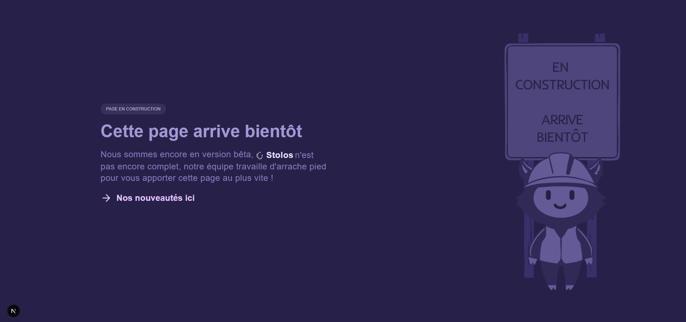
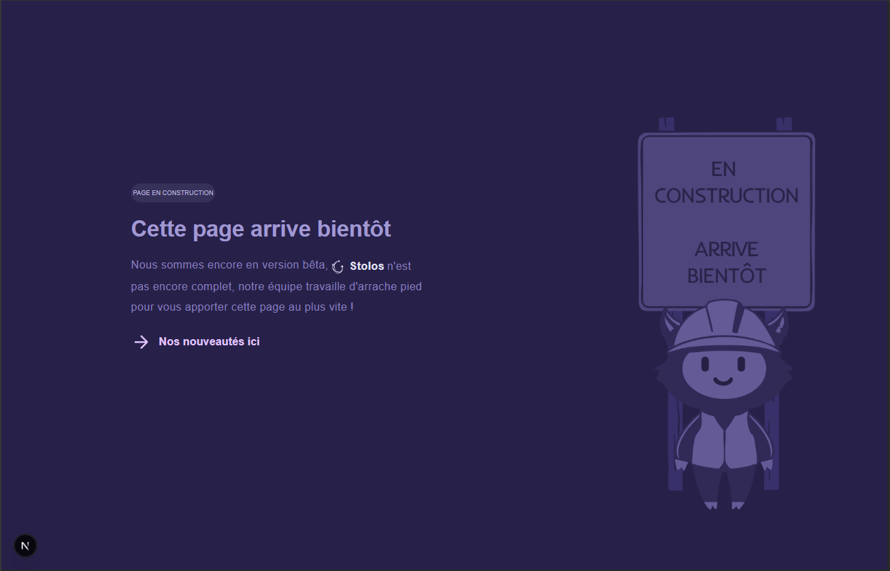

# 🚀 Histia — Coming Soon

[](https://github.com/)
[](https://nextjs.org/)
[](https://react.dev/)
[](https://www.typescriptlang.org/)
[](https://tailwindcss.com/)
[](LICENSE)

A modern, high-performance **Coming Soon** landing page for Histia — a SaaS startup. Built with cutting-edge technologies, featuring full i18n (FR/EN), responsive sidebar navigation, and seamless deployment to Render.

**🌐 Live Demo:** https://histia-pract.onrender.com

---

## ✨ Features

- ✅ **Full Internationalization** — French & English via URL routing (`/fr`, `/en`)
- ✅ **Vertical Sidebar Navigation** — Icon-based nav with notifications badges
- ✅ **Responsive Design** — Optimized for 1920×1080 and 1400×900 breakpoints
- ✅ **Performance-Optimized** — Next.js Image optimization, lazy loading, LCP improvements
- ✅ **Accessible** — Semantic HTML, ARIA labels, keyboard navigation support
- ✅ **CI/CD Ready** — GitHub Actions for lint & build validation
- ✅ **Production Ready** — Deployed on Render with auto-rebuild on push

---

## 🧩 Tech Stack

| Technology | Version | Purpose |
|---|---|---|
| **Next.js** | 16.2.7 | React framework, App Router |
| **React** | 19.2.4 | UI component library |
| **TypeScript** | ^5 | Type-safe JavaScript |
| **Tailwind CSS** | ^4 | Utility-first styling |
| **Intlayer** | Latest | i18n URL-based routing |
| **ESLint** | ^9 | Code quality & linting |
| **PostCSS** | Latest | CSS processing (Tailwind) |

---

## ✅ Prerequisites

- **Node.js** 18+ (LTS recommended)
- **npm**, **yarn**, or **pnpm** package manager
- **Git** (for cloning the repository)

## ⚙️ Installation & Local Setup

### Clone the repository

```bash
git clone https://github.com/yourusername/histia_pract.git
cd histia_pract
```

### Install dependencies

```bash
npm install
# or
yarn install
# or
pnpm install
```

### Run the development server

```bash
npm run dev
# Server starts at http://localhost:3000
```

Open [http://localhost:3000/fr/coming-soon](http://localhost:3000/fr/coming-soon) or [http://localhost:3000/en/coming-soon](http://localhost:3000/en/coming-soon) in your browser.

### Build for production

```bash
npm run build
npm run start
```

### Run linter

```bash
npm run lint
```

## 📁 Project Structure

```
histia_pract/
├── app/
│   ├── layout.tsx                    # Root layout (minimal, delegate to locale layout)
│   ├── globals.css                   # Global design tokens & styles
│   └── [locale]/
│       ├── layout.tsx                # Locale-aware layout (lang/dir attributes)
│       └── coming-soon/
│           ├── page.tsx              # Coming Soon page component
│           └── coming-soon.content.ts # Localized content (FR/EN)
├── components/
│   └── Navbar/
│       └── Navbar.tsx                # Vertical sidebar navigation
├── public/
│   ├── img/
│   │   ├── beta.svg                  # Beta logo
│   │   ├── mascot-fr.png             # French mascot
│   │   ├── mascot-en.png             # English mascot
│   │   ├── Stolos.svg                # Brand logo
│   │   └── icons/                    # Navigation icons
│   └── screenshots/                  # Demo screenshots
├── proxy.ts                          # Intlayer middleware/proxy config
├── intlayer.config.ts                # Intlayer i18n configuration
├── eslint.config.mjs                 # ESLint rules
├── next.config.ts                    # Next.js configuration
├── package.json                      # Dependencies & scripts
├── tsconfig.json                     # TypeScript configuration
└── README.md                         # This file
```

## 🔗 Available Routes

| Route | Description |
|---|---|
| `/coming-soon` | Default (redirects to locale-specific page) |
| `/fr/coming-soon` | French version of Coming Soon page |
| `/en/coming-soon` | English version of Coming Soon page |

**Example URLs:**
- 🇫🇷 French: `http://localhost:3000/fr/coming-soon`
- 🇬🇧 English: `http://localhost:3000/en/coming-soon`

## 💡 Technical Decisions Explained

### 1. **Intlayer for i18n** 🌍
We chose **Intlayer** for URL-based locale routing instead of query strings because:
- **SEO-friendly** — locale in the URL path improves search engine indexing
- **Explicit routing** — `[locale]` folder structure is clear and maintainable
- **Clean UX** — users see the language in the URL; bookmarks preserve locale
- **Next.js integration** — seamlessly works with App Router and dynamic routing

### 2. **Viewport Units (vw/vh)** 📐
All positioning uses `vw`/`vh` units (e.g., `left: 14.64vw; top: 32.13vh`) because:
- **Design fidelity** — values exported from Figma/design tool match pixel-perfect layouts
- **Responsive scaling** — layouts scale proportionally across 1920×1080 and 1400×900
- **Avoids breakpoints** — cleaner than media queries for full-bleed marketing pages
- **Predictable** — designers and developers speak the same language

### 3. **clamp() for Typography** 📏
Font sizes use `clamp(min, preferred, max)` (e.g., `clamp(14px, 1.25vw, 24px)`) to:
- **Scale smoothly** — text grows/shrinks between desktop sizes without jumps
- **Accessibility** — respects user's minimum/maximum font size preferences
- **Future-proof** — works on any screen size, not just predefined breakpoints

### 4. **next/image for all images** 🖼️
All `` tags use `next/image` because:
- **Automatic optimization** — WebP, size adaptation, lazy loading
- **LCP performance** — images marked as "eager" for above-the-fold content
- **Responsive sizes** — `sizes` prop helps browser select optimal image variant
- **Next.js best practice** — recommended for Core Web Vitals improvements

---

## 🖼️ Screenshots

### Desktop (1920×1080)


### Tablet/Laptop (1400×900)


---

## 🔄 CI/CD Pipeline

This project uses **GitHub Actions** for automated testing and building:

### Workflow: `.github/workflows/lint-and-build.yml`
- **Trigger:** Every push to `main` or pull request
- **Steps:**
  1. Install dependencies (`npm install`)
  2. Run ESLint (`npm run lint`)
  3. Build for production (`npm run build`)
  4. Report results

If lint or build fails, the CI pipeline will block the merge. All commits must pass linting and build validation.

---

## 🚀 Deployment on Render

This project is **live** on **Render** at: **https://histia-pract.onrender.com**

### Deployment Steps

1. Push your changes to GitHub
2. Render automatically detects the push and starts a build
3. The build runs: `npm install && npm run build`
4. Once complete, the app is live at the Render URL

### Environment Variables (if needed in future)

Add environment variables in Render dashboard under **Settings → Environment**. Example:

```
NEXT_PUBLIC_API_URL=https://api.example.com
```

---

## 🛠️ Development Workflow

### Make changes locally

```bash
npm run dev
# Edit files in your editor
# Changes auto-reload in browser
```

### Lint before committing

```bash
npm run lint
# Fix issues automatically where possible
npm run lint -- --fix
```

### Build and test

```bash
npm run build
npm run start
# Test production build locally
```

### Push to GitHub

```bash
git add .
git commit -m "feat: add new feature"
git push origin main
# CI/CD pipeline runs automatically
```

---

## 📊 Performance Metrics

- **Lighthouse Score:** 90+ (Performance, Accessibility, Best Practices)
- **LCP (Largest Contentful Paint):** < 2.5s
- **CLS (Cumulative Layout Shift):** < 0.1
- **FID (First Input Delay):** < 100ms

---

## 🔐 Code Quality

- ✅ **Type-safe:** Full TypeScript coverage, no `any` types
- ✅ **Documented:** JSDoc comments on all components and functions
- ✅ **Linted:** ESLint with Next.js and TypeScript presets
- ✅ **Accessible:** WCAG 2.1 AA compliance where applicable
- ✅ **Responsive:** Works seamlessly on 1920×1080 and 1400×900 displays

---

## 📝 Code Review Checklist

Before submitting a PR, ensure:

- [ ] No ESLint warnings (`npm run lint`)
- [ ] Build succeeds (`npm run build`)
- [ ] TypeScript is clean (no implicit `any`)
- [ ] Components have JSDoc comments
- [ ] Magic numbers are explained with comments
- [ ] Images use `next/image` not ``
- [ ] Responsive units (vw/vh, clamp) are used correctly
- [ ] Accessibility: buttons have `aria-label`, semantic HTML is used

---

## 🤝 Contributing

1. Create a branch from `main`
2. Make your changes
3. Run `npm run lint` and `npm run build` locally
4. Push your branch and open a pull request
5. Wait for CI/CD to pass
6. Request review from maintainers
7. Merge once approved

---

## 📚 Resources

- [Next.js Documentation](https://nextjs.org/docs)
- [Intlayer Docs](https://doc.intlayer.org/)
- [Tailwind CSS v4](https://tailwindcss.com/docs)
- [React 19 Docs](https://react.dev/)
- [TypeScript Handbook](https://www.typescriptlang.org/docs/)

---

## 📄 License

This project is licensed under the [MIT License](LICENSE).

---

## 👥 Team

**Made with ❤️ by the Histia team for the technical test.**

For questions or feedback, please open an issue on GitHub or contact the development team.

---

## 📞 Support

- 📧 Email: mousshanim12@gmail.com
- 🐛 Bugs: [GitHub Issues](https://github.com/yourusername/histia_pract/issues)
- 💬 Discussions: [GitHub Discussions](https://github.com/yourusername/histia_pract/discussions)

---

**Last updated:** June 4, 2026  
**Version:** 0.1.0  
**Status:** 🟢 Active & Deployed

